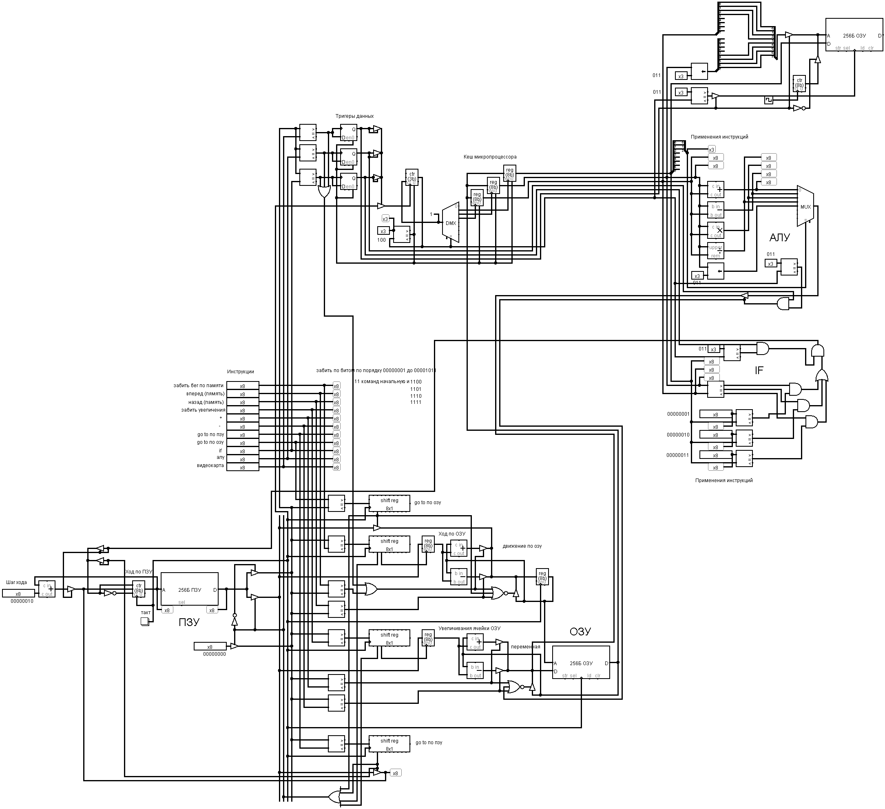

# microprocessor-in-Logisim

Учебный проект 8-битной ЭВМ в Logisim.

## Версия на реальных микросхемах 74xx

Готовая собираемая архитектура находится в [ЭВМ-7400.circ](ЭВМ-7400.circ). Логика, регистры, счётчики, АЛУ, флаги и шинные драйверы реализованы корпусами серии `74HC`; программная и управляющая память оформлены как реальные EEPROM/SRAM.

- [Инструкция запуска и устройство](hardware7400/README.md)
- [Набор команд и микрошаги](hardware7400/ISA.md)
- [Ведомость микросхем](hardware7400/BOM.md)

В схему уже записана демонстрационная программа. Нажмите `RESET`, затем включите `Simulate → Ticks Enabled` — ЭВМ выполнит программу и остановится на `HLT`.

## Исходная схема

Оригинальный школьный проект сохранён без изменений в [ЭВМ.circ](ЭВМ.circ).

Используется [Logisim](http://www.cburch.com/logisim/ru/index.html). Исходная библиотека микросхем лежит в каталоге [`logi7400`](logi7400).
