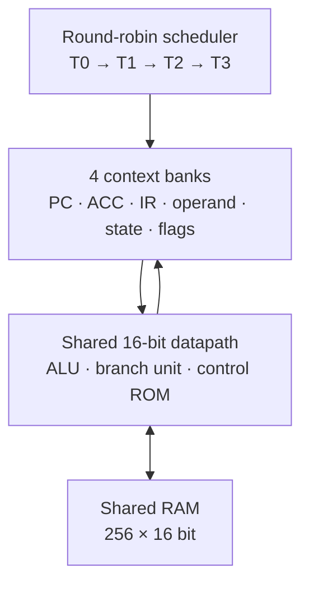

# MT16 — четырёхпоточный компьютер в Logisim


MT16 — полноценный 16-битный barrel-процессор с четырьмя аппаратными потоками,
общей памятью данных и микропрограммным управлением. Планировщик переключает
контекст **на каждом микрошаге**, поэтому пока один поток ждёт следующую фазу
команды, тракт данных обслуживает другой.

Исходный школьный проект не потерян: он остался без изменений в
[`ЭВМ.circ`](ЭВМ.circ). Новая, автономная схема находится в
[`hardware/MT16-Barrel-PC.circ`](hardware/MT16-Barrel-PC.circ) и рассчитана на
[Logisim Evolution 4.1.0](https://github.com/logisim-evolution/logisim-evolution/releases/tag/v4.1.0).



## Что внутри

- четыре независимых программных ROM и четыре набора регистров контекста;
- общий 16-битный аккумуляторный тракт и RAM `256 × 16`;
- настоящая управляющая ROM: 16 команд преобразуются в 32-битные микрокоманды;
- три фазы каждой команды: `FETCH_OPCODE → FETCH_OPERAND → EXECUTE`;
- атомарная `ATOMADD` для безопасного обмена между потоками;
- 16 команд: загрузка, сохранение, арифметика, логика, сдвиги, переходы и останов;
- встроенные выходные порты `OUT0…OUT3`, счётчик атомарных операций и отладочные выводы;
- ассемблер и потактовая эталонная модель без сторонних Python-зависимостей;
- детерминированный генератор `.circ`, ROM-образов и тестовых векторов.

## Быстрый запуск

1. Откройте `hardware/MT16-Barrel-PC.circ` в Logisim Evolution 4.1.0.
2. Выберите главную схему `MT16_Computer`.
3. Подайте импульс на `Reset`, затем включите такты (`Simulate → Ticks Enabled`).
4. Дождитесь `AllHalted = 1`.

Демонстрация уже записана в четыре ROM. Потоки одновременно вычисляют разные
задачи и синхронно увеличивают общий счётчик:

| Порт | Результат | Проверяемая работа |
|---|---:|---|
| `OUT0` | `0x0037` (55) | цикл и сумма `1…10` |
| `OUT1` | `0x00FA` (250) | `OR`, `XOR`, `NOT`, `AND` |
| `OUT2` | `0x0018` (24) | логические сдвиги |
| `OUT3` | `0x002A` (42) | загрузка и сложение |
| `RAM[0x30]` | `0x0004` | четыре атомарных прибавления |

Программу можно проверить отдельно от Logisim:

```bash
python3 tools/mt16.py run programs/demo.mt16 --trace
python3 tools/mt16.py build programs/demo.mt16
```

Синтаксис и точная семантика команд описаны в [ISA](docs/ISA.md), устройство
ядра — в [описании микроархитектуры](docs/MICROARCHITECTURE.md).

## Проверка

Обычные тесты модели:

```bash
python3 -m unittest discover -s tests -v
```

Полная аппаратная проверка требует Java 21 и jar-файл Logisim Evolution 4.1.0:

```bash
LOGISIM_JAR=/path/to/logisim-evolution-4.1.0-all.jar scripts/test-all.sh
```

Проверка пересобирает схему, запускает Python-тесты, затем загружает `.circ`
официальным движком Logisim и прогоняет:

| Схема | Векторы |
|---|---:|
| `ALU16` | 16 |
| `MicrocodeControl` | 16 |
| `Scheduler4` | 19 |
| `MT16_Computer` | 2446 |
| **Всего** | **2497** |

Тест `MT16_Computer` — последовательная связная трасса всей микропрограммы, а
не набор изолированных логических проверок. CI повторяет тот же прогон на каждом
push и pull request.

## Структура проекта

```text
hardware/MT16-Barrel-PC.circ   готовый компьютер для Logisim
hardware/generate.py           генератор схемы и аппаратных тест-векторов
hardware/tests/                векторы официального тестового движка Logisim
programs/demo.mt16             четырёхпоточная демонстрационная программа
mt16/core.py                   ISA, ассемблер и эталонная модель
tools/mt16.py                  CLI сборки и запуска
docs/                          спецификация ISA и микроархитектуры
ЭВМ.circ                       оригинальная схема проекта
```

Генерируемая схема не использует внешнюю библиотеку `logi7400`; каталог сохранён
только ради совместимости и истории исходного проекта.
